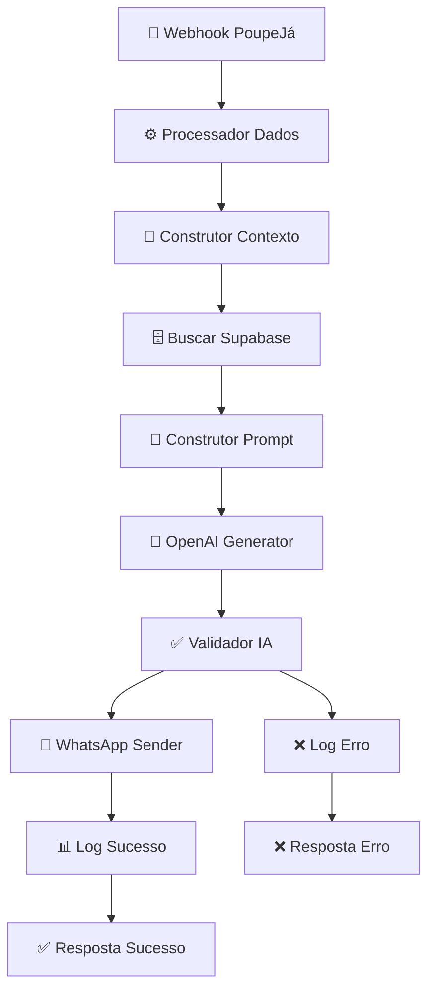

# 🤖 Fluxo N8N MCP + OpenAI + Supabase - Documentação Completa

## 📋 Visão Geral

Este fluxo N8N implementa uma integração avançada usando **Model Context Protocol (MCP)** com **OpenAI** e **Supabase** para gerar mensagens WhatsApp personalizadas e inteligentes baseadas no contexto completo do usuário.

## 🏗️ Arquitetura do Fluxo

### **1. 🎯 Webhook Trigger** 
- **Endpoint**: `/poupeja-mcp-webhook`
- **Método**: POST
- **Função**: Recebe dados do sistema PoupeJá

### **2. ⚙️ Processador de Dados**
- **Função**: Validação e normalização inicial
- **Processos**:
  - Validação de payload
  - Normalização de telefone brasileiro
  - Extração de configurações Evolution API
  - Preparação de dados estruturados

### **3. 🧠 Construtor de Contexto**
- **Função**: Prepara queries para buscar dados contextuais
- **Contexto Coletado**:
  - Perfil do usuário
  - Transações recentes (últimos 30 dias)
  - Metas ativas
  - Orçamentos vigentes
  - Categorias personalizadas

### **4. 🗄️ Buscar Dados Supabase**
- **Função**: Busca dados contextuais no banco
- **Tabelas Consultadas**:
  - `poupeja_users` - Perfil do usuário
  - `poupeja_transactions` - Histórico financeiro
  - `poupeja_goals` - Metas financeiras
  - `poupeja_budgets` - Orçamentos
  - `poupeja_categories` - Categorias personalizadas

### **5. 📝 Construtor de Prompt IA**
- **Função**: Cria prompt contextualizado para OpenAI
- **Características**:
  - Contexto financeiro completo
  - Prompt personalizado por tipo de evento
  - Diretrizes de linguagem e tom
  - Limitações de tamanho (200 chars)

### **6. 🤖 Gerador OpenAI**
- **Modelo**: GPT-4o-mini (configurável)
- **Configurações**:
  - Temperature: 0.7
  - Max Tokens: 150
  - Prompt personalizado com contexto MCP

### **7. ✅ Validador IA**
- **Função**: Valida se a mensagem foi gerada com sucesso
- **Fluxos**: Sucesso → WhatsApp | Erro → Log de Erro

### **8. 📲 Enviar WhatsApp**
- **API**: Evolution API
- **Configuração**: Dinâmica via payload
- **Timeout**: 30 segundos
- **Retry**: 3 tentativas

### **9. 📊 Sistema de Logs**
- **Log de Sucesso**: Métricas completas de processamento
- **Log de Erro**: Debugging detalhado
- **Persistência**: Console logs + resposta estruturada

## 🔄 Fluxo de Dados



## 📊 Estrutura de Dados

### **Payload de Entrada**
```json
{
  "type": "goal_progress",
  "user": {
    "id": "uuid",
    "name": "João Silva", 
    "phone": "11999999999",
    "email": "joao@email.com"
  },
  "data": {
    "title": "Viagem Europa",
    "progress": 75,
    "amount": 6000
  },
  "metadata": {
    "evolutionApi": {
      "apiUrl": "https://evolution.api.com",
      "apiKey": "key123",
      "instance": "instance1"
    }
  }
}
```

### **Contexto MCP Gerado**
```json
{
  "userProfile": {
    "name": "João Silva",
    "email": "joao@email.com",
    "phone": "5511999999999"
  },
  "recentTransactions": [
    {
      "type": "expense",
      "amount": -150.50,
      "description": "Supermercado",
      "date": "2025-01-25"
    }
  ],
  "activeGoals": [
    {
      "name": "Viagem para Europa",
      "target_amount": 8000.00,
      "current_amount": 6000.00,
      "progress": 75
    }
  ],
  "activeBudgets": [...],
  "userCategories": [...]
}
```

## 🎯 Tipos de Eventos Suportados

### **1. Compromissos**
- `appointment_created`
- `appointment_reminder`

**Mensagem Exemplo**: *"Oi João! 📅 Lembrete: você tem 'Consulta Médica' hoje. Não esqueça de registrar os gastos no PoupeJá depois! 💙"*

### **2. Transações**
- `transaction_due`
- `transaction_reminder`

**Mensagem Exemplo**: *"João, está na hora! 💳 Conta de luz de R$ 120,00 vence hoje. Já está no seu orçamento? 📊"*

### **3. Metas**
- `goal_progress`
- `goal_achieved`

**Mensagem Exemplo**: *"🎉 Parabéns João! Você está 75% mais perto da sua meta 'Viagem Europa'. Continue assim! 💪"*

### **4. Orçamentos**
- `budget_exceeded`

**Mensagem Exemplo**: *"⚠️ Opa João! Seu orçamento de alimentação passou do limite. Que tal revisar os gastos no PoupeJá? 📱"*

### **5. Personalizado**
- `custom`

**Mensagem Exemplo**: *"Oi João! 👋 Temos uma atualização para você no PoupeJá! Confira o app! 📱💙"*

## 🚀 Vantagens do MCP

### **1. Contexto Rico**
- Dados financeiros completos
- Histórico de transações
- Metas e orçamentos atuais
- Perfil personalizado

### **2. Mensagens Inteligentes**
- Personalizadas por usuário
- Baseadas em dados reais
- Contexto temporal relevante
- Tom apropriado ao evento

### **3. Escalabilidade**
- Processamento eficiente
- Fallbacks para erros
- Logs detalhados
- Configuração dinâmica

## 📈 Métricas e Monitoramento

### **Logs de Sucesso**
```json
{
  "timestamp": "2025-01-27T12:00:00Z",
  "status": "success",
  "user": { "id": "uuid", "name": "João" },
  "message": { "content": "...", "length": 156 },
  "processing": { "total_time_ms": 1250 }
}
```

### **Logs de Erro**
```json
{
  "timestamp": "2025-01-27T12:00:00Z", 
  "status": "error",
  "error": { "message": "...", "type": "..." },
  "context": { "step_failed": "ai_validation" }
}
```

## 🔧 Configuração e Deploy

### **1. Importar no N8N**
1. Copie o conteúdo de `poupeja-mcp-ai-flow.json`
2. No N8N: Import → From JSON
3. Cole o conteúdo e confirme

### **2. Configurar Credenciais**
- **OpenAI API Key**: Configurada via Supabase Secrets
- **Evolution API**: Dinâmica via payload
- **Supabase**: Configuração automática

### **3. Ativar Fluxo**
1. Ative o fluxo no N8N
2. Copie a URL do webhook
3. Configure no PoupeJá

### **4. URL do Webhook**
```
https://sua-instancia-n8n.com/webhook/poupeja-mcp-webhook
```

## 🧪 Teste da Integração

### **Payload de Teste**
```bash
curl -X POST https://n8n.com/webhook/poupeja-mcp-webhook \
  -H "Content-Type: application/json" \
  -d '{
    "type": "goal_progress",
    "user": {
      "id": "test-user",
      "name": "João Teste",
      "phone": "11999999999",
      "email": "joao@teste.com"
    },
    "data": {
      "title": "Meta de Teste",
      "progress": 50
    }
  }'
```

### **Resposta Esperada**
```json
{
  "success": true,
  "message": "Mensagem AI personalizada enviada com sucesso",
  "data": {
    "user_id": "test-user",
    "message_sent": "🎉 Parabéns João! Você está 50% mais perto...",
    "processing_time_ms": 1250
  }
}
```

## 🔍 Troubleshooting

### **Erro: "Telefone inválido"**
- **Causa**: Formato incorreto do telefone
- **Solução**: Verificar se está no formato brasileiro

### **Erro: "OpenAI API failed"**
- **Causa**: API Key inválida ou limite excedido
- **Solução**: Verificar configuração no Supabase Secrets

### **Erro: "Evolution API timeout"**
- **Causa**: URL ou instância incorreta
- **Solução**: Validar configurações no payload

### **Erro: "Contexto incompleto"**
- **Causa**: Falha na busca de dados do Supabase
- **Solução**: Verificar permissões RLS e queries

## 🎯 Próximos Passos

1. **Implementar Supabase Real**: Substituir simulação por queries reais
2. **OpenAI Real**: Implementar chamada real para API
3. **Cache de Contexto**: Otimizar consultas frequentes
4. **A/B Testing**: Testar diferentes prompts
5. **Analytics**: Métricas de engajamento
6. **Personalization**: Machine Learning para preferências

## 📚 Referências

- [OpenAI API Documentation](https://platform.openai.com/docs)
- [Evolution API Documentation](https://evolution-api.com/docs)
- [Supabase Documentation](https://supabase.com/docs)
- [N8N Documentation](https://docs.n8n.io)
- [Model Context Protocol](https://modelcontextprotocol.io)